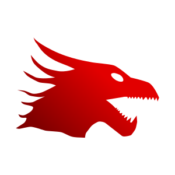

<p align=center>

<h1 align=center>DragonHeartOS</h1>
<p align=center>General purpose operating system</p>
</p>

## What is this?

The operating system is made to give you full control over your hardware from the display, audio or even serial. Currently, the operating system is in a _very_ primitive state.

## Getting started

The system can be build and ran like this:

```
$ cd .. && mkdir Build && cd Build # Create Build directory
$ cmake -B Build -G Ninja \
  -DCMAKE_TOOLCHAIN_FILE=cmake/x86_64-elf-clang.cmake \
  -DCMAKE_C_COMPILER=clang \
  -DCMAKE_CXX_COMPILER=clang++
$ cmake --build Build           # Compile!
$ cmake --build Build -- image  # Create disk image
$ cmake --build Build -- run    # Run virtual machine
```

## Goals

 - 64-bit
 - Multitasking kernel
 - Everything is easly accessible to the user, including the hardware (ring-0)
 - Filesystem: FAT-32

## Components

 - Katline -> The kernel
 - SysInit -> Init system

### Services

 - AppBus -> Message bus
 - WinManager -> Window manager

### Libraries 

 - CommonLib -> C++ utility library
 - Marine -> The C/C++ library
 - Elf -> ELF Parser
 - Graphix -> Graphics library
 - Beyond -> The main GUI library

## License

This software is licensed under the AGPLv3 license. Learn more about it [here](LICENSE).
